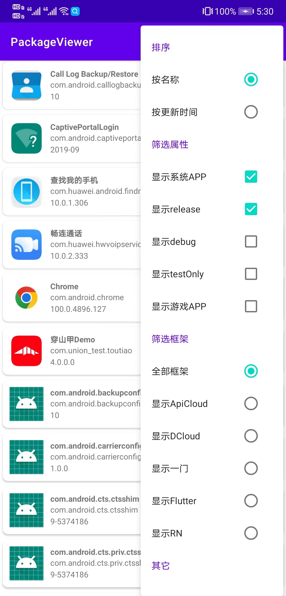

# PackageViewer

 Android本机应用查看器，快速查看包名、版本号、签名信息

## 预览

## 功能

- 显示应用列表

- 搜索

- 筛选排序

- 应用详细信息，包含签名信息、更新时间等 （长按 value 部分可以复制）

- 启动 / 卸载

## Feature

- 打印签名信息 （唯一有用的功能）

- 快速加载模式 （几乎没有变快）

- 没有任何审美可言的 UI

- 粗糙的配色

## 链接

- [Github](https://github.com/MaYiFei1995/PackageViewer)

- [Release](https://github.com/MaYiFei1995/PackageViewer/releases)

- [Issues](https://github.com/MaYiFei1995/PackageViewer/issues/new)

- [BaseRecyclerViewAdapterHelper](https://github.com/CymChad/BaseRecyclerViewAdapterHelper)