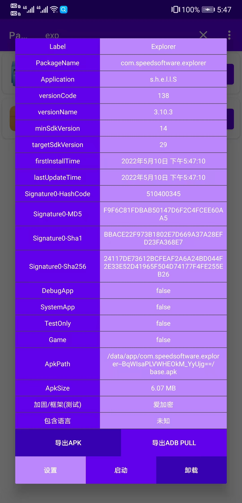

# PackageViewer

 Android本机应用查看器，快速查看包名、版本号、签名信息、导出 APK 文件和 adb pull 命令

## 预览

## 功能

- 显示应用列表

- 搜索

- 筛选排序

- 应用详细信息，包含签名信息、更新时间等 （长按 value 部分可以复制）

- 发送 apk 文件 / 发送 adb pull 命令 (无法获取设备号，不能直接导出 adb -s serialno pull ...)

- 启动 / 卸载 / 跳转到设置页

## Feature

- 打印签名信息 （唯二有用的功能）

- 导出 apk 文件和 adb pull 命令

- 快速加载模式 （几乎没有变快）

- 没有任何审美可言的 UI

- 粗糙的配色

## 链接

- [Github](https://github.com/MaYiFei1995/PackageViewer)

- [Release](https://github.com/MaYiFei1995/PackageViewer/releases)

- [Issues](https://github.com/MaYiFei1995/PackageViewer/issues/new)

- [BaseRecyclerViewAdapterHelper](https://github.com/CymChad/BaseRecyclerViewAdapterHelper)